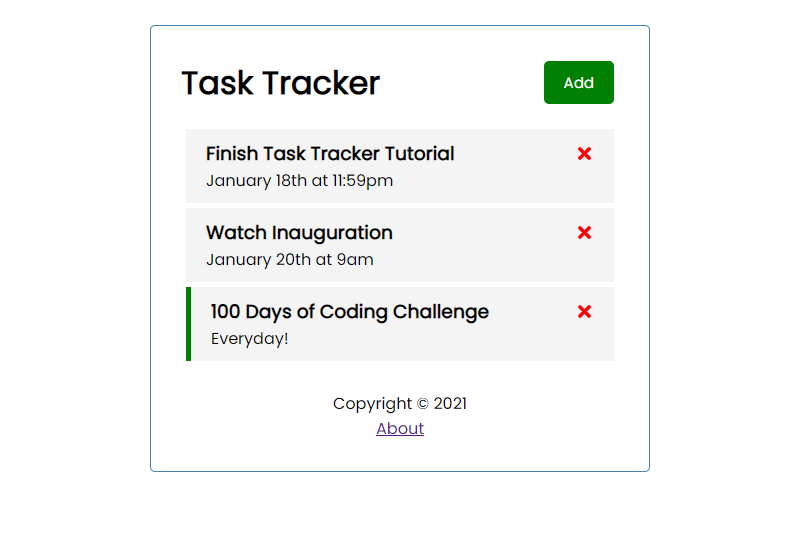
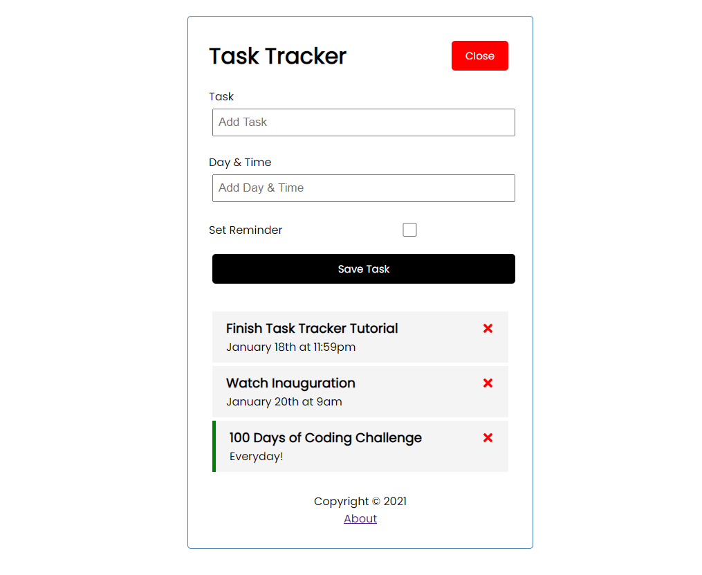
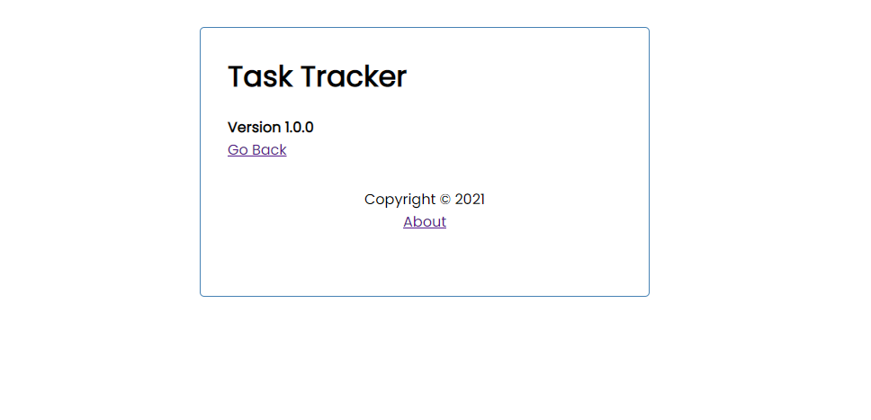

# Task Tracker


 

## Description
Using React and a JSON-server this Task Tracker app can be used to add tasks to your busy schedule. Add tasks by entering the Task, Date and Time, and clicking 'Save Task'. Setting a reminder will show a green line to the right of the task. Delete Tasks with the 'X' to the right of the tasks. 
<br><br>
This app follows Brad Tracvesy's React JS Crash Course Course 2021. Link below. 


## **Table of Contents**
1. [Usage](#usage)
2. [Questions](#questions)
3. [Visuals](#visuals)
4. [Links](#links)


## **Usage**

### Clone Repo

```
git clone git@github.com:kbnewlon/react-task-tracker.git
```

### Install dependencies

```
npm install
```

### Run React dev server

```
npm start
```

### Run the JSON server in a new terminal

```
npm run server
```

## **Questions**
Contact me at kayla.b.newlon@gmail.com for any questions 

## **Visuals**




## **Links**
Repo: https://github.com/kbnewlon/react-task-tracker<br>
Tutorial by Traversy Media: https://www.youtube.com/watch?v=w7ejDZ8SWv8&ab_channel=TraversyMedia